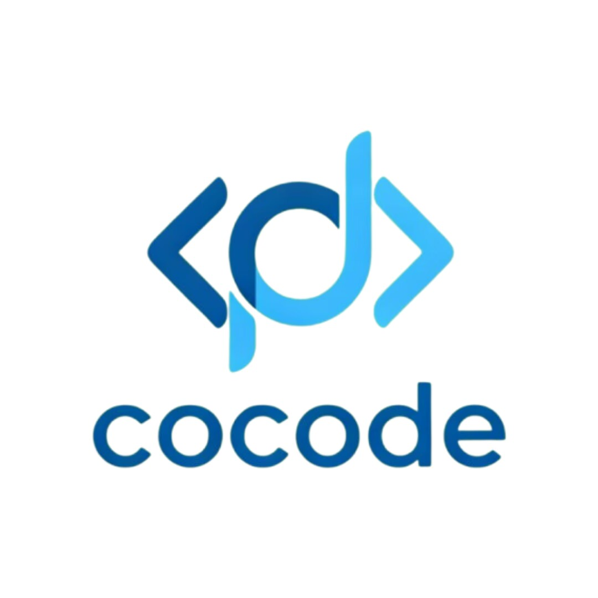

# cocodeAI

  

**酷码工作室出品 · 下一代 AI 编程助手**

---

## 这是什么

cocodeAI 是**酷码工作室**历时打磨、完全自研的 AI 编程 Agent 桌面客户端。

不同于普通的 AI 聊天工具，cocodeAI 把 Agent 真正嵌入你的开发流程——它能读代码、改文件、跑命令、审权限，像一个真正懂你项目的搭档坐在旁边。界面采用苹果设计语言，科技蓝色调，干净、克制、专注。

---

## 能做什么

- **多项目并行** — 左侧边栏同时管理多个工程，随时切换，互不干扰
- **代码级 Diff** — AI 每次改动都有清晰的变更视图，改了什么一目了然
- **权限沙箱** — 每个危险操作都需要你点头，AI 不会背着你乱跑
- **Worktree 管理** — 多分支并行开发，不用来回切换
- **定时 Agent** — 设定时间，让 AI 自动跑任务，早上来看结果就行
- **手机远程** — H5 入口，出门在外也能用手机控制 Agent 干活
- **多模型接入** — Claude、OpenAI，想用哪个接哪个

---

## 下载

> 🚧 安装包正在打包中，敬请期待。  
> Star 本仓库，第一时间收到发布通知。

发布后将支持以下平台：

| 平台 | 格式 |
|------|------|
| macOS | `.dmg` |
| Windows | `.exe` / `.msi` |

---

## 关于酷码工作室

我们是一支专注 AI 工具研发的小团队，cocodeAI 是我们的核心产品。  
我们相信好的 AI 工具应该让人用得顺手，而不是让人迁就它。

---

## License

[MIT](LICENSE)
